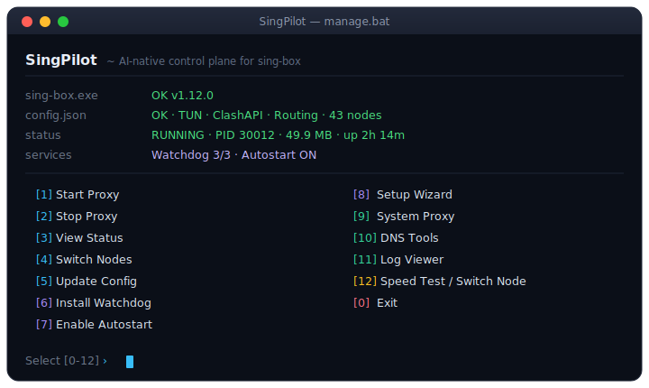
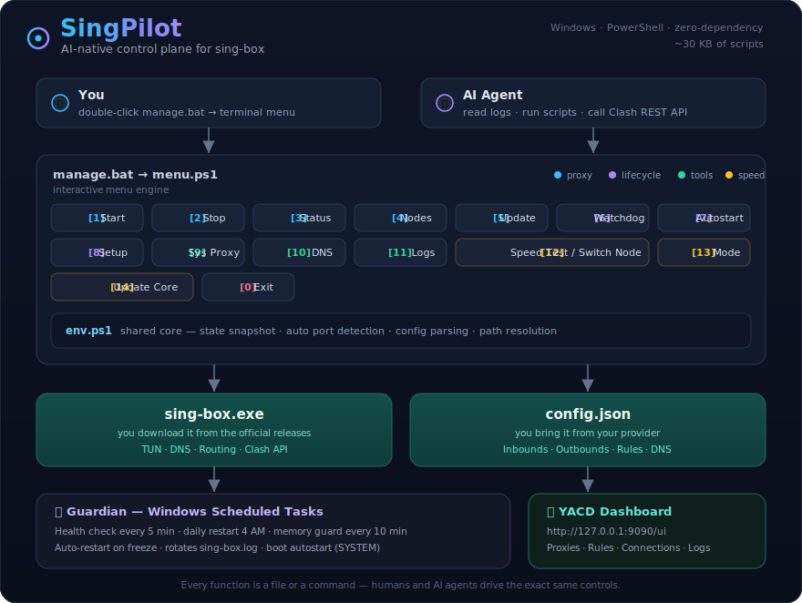

<h1 align="center">SingPilot</h1>

<p align="center">
  <b>AI-native control plane for sing-box</b>
  <br>
  <sub>终端菜单 · 自动健康守护 · 零依赖 · 可被 AI Agent 编程控制</sub>
</p>

<p align="center">
  
  
  
  
  
</p>

<p align="center">
  
</p>

---

[中文](#中文) | [English](#english)

---

<h2 id="中文">🇨🇳 中文</h2>

### 这是什么

[sing-box](https://github.com/Sagernet/sing-box) 是一个强大的代理内核，但它是个命令行程序——没有 GUI、没有健康监控、没有开机自启。

市面上大部分用户会选择 200MB+ 的 Electron 桌面应用来获得友好界面。

**SingPilot** 走了另一条路：**几十 KB 的纯 PowerShell 脚本，给 sing-box 配上终端菜单、自动健康守护、零依赖**。

而且因为一切操作都是文件 + 命令，**AI Agent（Claude Code、Copilot、Cursor）可以读取日志、诊断问题、编程式控制代理**——这正是 "control plane"（控制平面）的含义：人点菜单，AI 调脚本，走的是同一套控制入口。

### 架构

<p align="center">
  
</p>

### 功能

#### 核心

| 功能 | 说明 |
|---|---|
| 一键启停 | 双击 `manage.bat`，选择 [1] 或 [2] |
| 状态面板 | PID、内存、运行时长、TUN 网卡、端口、连通性——全在一屏 |
| 节点切换 | 内置 YACD 面板，`http://127.0.0.1:9090/ui` |
| 订阅更新 | 从服务商拉取最新配置，自动验证，失败自动回滚 |
| 开机自启 | Windows 计划任务，SYSTEM 权限，崩溃重试 ×3 |

#### 🛡️ 看门狗

主打功能——**代理卡死自动恢复：**

| 任务 | 频率 | 功能 |
|---|---|---|
| 健康检查 | 每 5 分钟 | 进程存活？端口监听？网络可达？→ 异常自动重启 |
| 每日重启 | 凌晨 4:00 | 主动重启，防止慢性内存泄漏 |
| 内存保护 | 每 10 分钟 | 内存 > 600MB → 自动重启 |

所有事件记录在 `logs\watchdog.log`，AI Agent 可直接读取诊断。

#### 🖥️ 系统代理开关

一键切换 Windows 系统代理。不想用 TUN 模式时，让浏览器走本地代理端口（自动从 `config.json` 的 mixed 入站读取），其余应用直连。

#### 🌐 DNS 工具

查看当前 config.json 中的 DNS 配置摘要 + 一键测速对比阿里/腾讯/Google DNS 延迟。

#### 📜 日志查看器

查看 sing-box 实时日志，支持切换日志级别（trace/debug/info/warn/error），也可查看看门狗历史日志。

#### 🤖 AI 友好

```
# 任何 AI Agent 都能做的事：
cat logs\watchdog.log                              # 读取历史日志
powershell -File scripts\status.ps1                 # 查看实时状态
Invoke-RestMethod :9090/proxies                     # 列出所有节点
Invoke-RestMethod :9090/proxies/MAIN -Method PUT \
  -Body '{"name":"JP-1"}'                           # 切换节点
powershell -File scripts\start.ps1                  # 重启代理
```

不需要 GUI 点击，不需要 OCR，不需要截图。**每一项功能都是一个命令或文件。**

### 快速开始

```
1. 下载 sing-box.exe → 放到此目录
   https://github.com/Sagernet/sing-box/releases

2. 获取 config.json → 放到此目录
   （从你的服务商获取；也可复制 config.example.json 改成自己的节点）

3. 双击 manage.bat → [8] 初始化向导
```

就这三步。向导会自动检测一切并配置开机自启 + 看门狗。

### 目录结构

```
singpilot/
├── manage.bat              ← 🔥 唯一入口
├── diagnose.bat            ← 一键网络诊断
├── sing-box.exe            ← 你放进来
├── config.json             ← 你放进来
├── config.example.json     ← 配置模板（参照它改）
│
├── scripts/                 ← 所有逻辑
│   ├── env.ps1              ← 环境检测核心
│   ├── menu.ps1             ← 交互菜单引擎
│   ├── setup.ps1            ← 一键初始化向导
│   ├── start.ps1 / stop.ps1
│   ├── status.ps1           ← 诊断面板
│   ├── update.ps1           ← 订阅更新
│   ├── watchdog.ps1         ← 健康守护
│   ├── sysproxy.ps1         ← 系统代理开关
│   ├── dnstool.ps1          ← DNS 工具
│   └── logview.ps1          ← 日志查看
│
├── ui/                      ← YACD 面板
├── logs/                    ← watchdog.log
├── backup/                  ← 配置备份
└── README.md
```

### 要求

- **Windows** (10/11)
- **PowerShell 5.1+** (系统自带，无需安装)
- **sing-box.exe** (从[官方](https://github.com/Sagernet/sing-box/releases)下载)
- **config.json** (从服务商获取)
- **管理员权限** (仅 TUN 模式需要，右键 `manage.bat` → 以管理员身份运行)

无其他依赖。不需要 Node.js、Electron、.NET Runtime、Docker。

### FAQ

**Q: AI Agent 真的能控制这个？**
A: 能。所有功能都是脚本文件或 REST API 调用。AI 可以 `cat watchdog.log` 看代理是否冻结过，`Invoke-RestMethod :9090/proxies` 切换节点，或运行 `scripts/status.ps1` 获取结构化状态报告——完全不需要 GUI。

**Q: 内置了 sing-box 或代理节点吗？**
A: 都没有。纯脚本工具。sing-box 从官方下载，config.json 从你自己的服务商获取。

**Q: 跟 Clash Verge 能同时用吗？**
A: 不能。两个 TUN 会冲突。二选一。

---

<h2 id="english">🇬🇧 English</h2>

### What

**SingPilot** is an AI-native control plane for [sing-box](https://github.com/Sagernet/sing-box) — a lightweight launcher and health guardian in a few tens of KB of pure PowerShell.

No Electron. No Node.js. No bloat. Just scripts that give sing-box a clean terminal menu, automatic health monitoring, and zero-dependency operation.

**Humans and AI agents drive the same controls.** Every function is a script file or REST API call — AI tools (Claude Code, Copilot, Cursor) can read logs, diagnose issues, switch nodes, and restart the proxy programmatically.

### Architecture

<p align="center">
  
</p>

### Features

- **Interactive Menu** — `manage.bat` with 11 options: Start, Stop, Status, Nodes, Update, Watchdog, Autostart, Setup, System Proxy, DNS Tools, Log Viewer
- **Watchdog** — 3 Windows Scheduled Tasks: health check every 5min, daily restart at 4am, auto-restart if memory exceeds 600MB
- **System Proxy** — Toggle Windows system proxy on/off; the local proxy port is auto-detected from your `config.json` mixed inbound
- **DNS Tools** — View current DNS config + benchmark Ali/Tencent/Google DNS latency
- **Log Viewer** — Read sing-box and watchdog logs, change log level on the fly
- **Status Dashboard** — PID, memory, uptime, TUN adapter, listening ports, domestic/foreign connectivity — one screen
- **Node Switching** — Built-in YACD dashboard at `http://127.0.0.1:9090/ui`
- **AI-Native** — Every component is a file or command. AI agents can read `watchdog.log`, run `status.ps1`, call the Clash API, or restart sing-box — no GUI interaction required.

### Quick Start

```
1. Download sing-box.exe → place in this directory
2. Get config.json → place in this directory (or copy config.example.json and edit it)
3. Double-click manage.bat → [8] Setup Wizard
```

### Requirements

- Windows 10/11
- PowerShell 5.1+ (built-in)
- sing-box.exe (from [official releases](https://github.com/Sagernet/sing-box/releases))
- config.json (from your service provider)

No other dependencies.

### License

MIT — scripts only. sing-box itself is [GPLv3](https://github.com/Sagernet/sing-box/blob/main/LICENSE) and must be downloaded separately.
